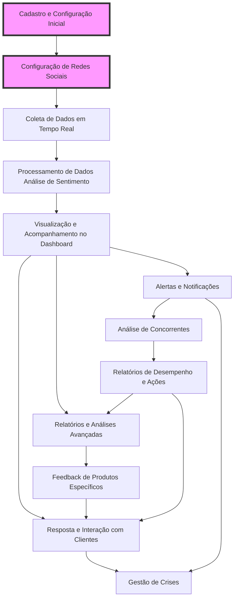

# Sentimentify - A Plataforma de Análise de Sentimentos para Comerciantes

Sentimentify é uma plataforma SaaS (Software as a Service) inovadora para análise de sentimentos em tempo real nas redes sociais. Ela permite que comerciantes, lojas e marcas monitorem e entendam a percepção do público sobre seus produtos, serviços e campanhas, utilizando inteligência artificial e processamento de linguagem natural (PLN).

💡 Visão Geral
O Sentimentify fornece insights valiosos sobre as opiniões dos clientes com base nas interações nas redes sociais, como Twitter, Instagram, Facebook, e muito mais. A plataforma classifica as menções como positivas, negativas ou neutras, permitindo que os comerciantes tomem decisões rápidas e estratégicas para aprimorar sua imagem e engajamento com o público.

🚀 Funcionalidades
Análise de Sentimentos: Identificação de sentimentos positivos, negativos e neutros em menções de redes sociais.
Monitoramento em Tempo Real: Acompanhamento instantâneo das menções nas redes sociais e alertas sobre crises ou oportunidades.
Relatórios Interativos: Dashboards dinâmicos com gráficos e insights sobre a percepção da marca.
Análise Competitiva: Comparação de sentimentos de sua marca com a concorrência.
Recomendações Automáticas: Ações sugeridas com base nos sentimentos identificados (ex: intensificar campanhas ou lidar com críticas).
Geolocalização: Monitoramento de sentimentos por região.
Integrações com CRM: Sincronização com ferramentas de CRM e marketing para otimizar campanhas e interações com clientes.

🎯 Por que usar o Sentimentify?
Gerencie sua Reputação: Monitore o que está sendo falado sobre sua marca nas redes sociais.
Melhore suas Estratégias de Marketing: Tome decisões baseadas em dados reais sobre o que seu público pensa.
Prevenção de Crises: Identifique problemas antes que se tornem uma crise.
Aumente o Engajamento com o Cliente: Responda rapidamente a feedbacks e melhore a experiência do cliente.

🛠 Como Funciona?
Coleta de Dados: O Sentimentify coleta dados de menções nas redes sociais e outros canais digitais.
Análise de Sentimentos: O sistema utiliza inteligência artificial e processamento de linguagem natural para classificar as menções.
Geração de Relatórios: Dados processados são convertidos em relatórios visualmente ricos, prontos para análise.
Ações Proativas: Com base nos dados de sentimentos, o Sentimentify sugere ações que os comerciantes podem tomar (como ajustar campanhas ou responder a feedbacks).

⚙️ Tecnologias Utilizadas
Inteligência Artificial e Machine Learning: Para análise de sentimentos e recomendação de ações.
APIs de Redes Sociais: Para coleta de dados de plataformas como Twitter, Instagram, Facebook e outras.
Dashboard Interativo: Desenvolvido com frameworks modernos para visualização de dados.
Integração com CRMs: Para otimizar o relacionamento com o cliente e automatizar processos.

📦 Como Começar
Cadastro: Crie uma conta no Sentimentify.
Integração com Redes Sociais: Conecte suas contas de redes sociais ao Sentimentify.
Análise de Sentimentos: Comece a monitorar menções e analisar sentimentos em tempo real.
Ações e Relatórios: Utilize as recomendações da plataforma para melhorar suas campanhas.

📈 Casos de Uso
Monitoramento de Campanhas Publicitárias: Acompanhe em tempo real a reação do público à sua campanha.
Gestão de Crises: Detecte rapidamente menções negativas e atue para resolver problemas.
Fidelização de Clientes: Identifique clientes satisfeitos e crie programas de fidelidade com base em sentimentos positivos.
Análise Competitiva: Compare o sentimento da sua marca com o dos concorrentes e ajuste sua estratégia.

🌎 Para Quem é o Sentimentify?
Comerciantes: Pequenas e grandes lojas, e-commerce, empresas locais.
Marcas: Marcas que desejam melhorar sua imagem online e aumentar o engajamento com os clientes.
Agências de Marketing: Agências que precisam de dados para otimizar as campanhas de seus clientes.

🔒 Privacidade e Segurança
A privacidade dos dados é uma prioridade. O Sentimentify segue as melhores práticas de segurança para garantir que os dados coletados das redes sociais sejam tratados com confidencialidade.

📝 Licença
Distribuído sob a licença XYZ. Veja mais detalhes em LICENÇA.md.

📞 Suporte e Contato
Se você precisar de ajuda, entre em contato conosco pelo e-mail: suporte@sentimentify.com.

